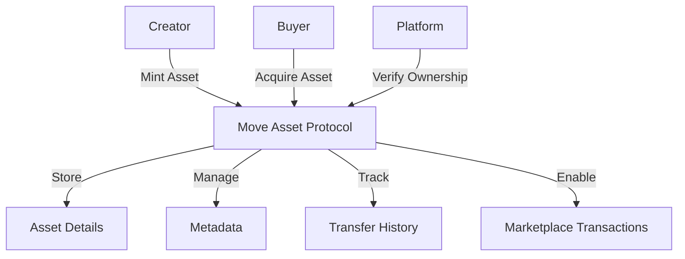

# Beta Move: Digital Asset Protocol

A decentralized protocol for registering, managing, and trading digital assets across immersive environments.

## Overview

Beta Move provides a secure, trustless infrastructure for digital asset management. It empowers creators, developers, and users with:

- Minting unique digital assets as transferable tokens
- Secure asset trading with embedded royalty mechanisms
- Verifiable ownership and comprehensive provenance tracking
- Cross-platform compatibility through standardized metadata
- Flexible usage rights and transfer permissions

## Architecture

The protocol centers on a flexible asset management contract that handles registration, ownership, and marketplace interactions.



### Core Protocol Components
- Asset Registry: Core data and ownership management
- Metadata Management: Comprehensive asset information storage
- Transfer Ledger: Detailed provenance tracking
- Market Mechanism: Secure, royalty-enabled transactions

## Contract Documentation

### Move Asset Protocol

A comprehensive smart contract for digital asset lifecycle management.

#### Key Capabilities
- Detailed asset registration with rich metadata
- Ownership transfer and historical tracking
- Native marketplace with automated royalty distribution
- Cross-platform ownership verification
- Dynamic metadata and settings updates

#### Governance Principles
- Owner-exclusive asset modifications
- Transparent royalty enforcement
- Configurable transferability rules

## Getting Started

### Requirements
- Clarinet
- Stacks Wallet
- STX Tokens

### Quick Start Example

1. **Mint a New Digital Asset**
```clarity
(contract-call? .move-asset-protocol mint-digital-asset
    "https://asset-metadata.uri"
    "Innovative 3D Model"
    "A groundbreaking digital creation"
    {width: u100, height: u100, depth: u100}
    (list "Platform1" "Platform2")
    "Creative"
    "GLB"
    true
    u50)
```

2. **Transfer Asset Ownership**
```clarity
(contract-call? .move-asset-protocol transfer-asset-ownership asset-id new-owner-address)
```

## Function Reference

### Primary Functions

#### Asset Management
- `mint-digital-asset`: Create new asset registration
- `transfer-asset-ownership`: Transfer to new owner
- Metadata and settings update capabilities

#### Transaction Mechanisms
- Marketplace listing
- Secure asset transfers
- Royalty distribution

### Query Functions
- Asset details retrieval
- Metadata exploration
- Ownership verification
- Transfer history access

## Development

### Testing
1. Clone repository
2. Install Clarinet
3. Execute tests:
```bash
clarinet test
```

## Security & Compliance

### Protocol Limitations
- Transfer history: Last 10 transactions
- Royalty cap: 50%
- Metadata length restrictions

### Security Best Practices
- Validate ownership before interactions
- Verify asset transferability
- Authenticate metadata sources
- Ensure precise royalty calculations
- Monitor transfer events meticulously

## Contribution

Interested in improving the Beta Move protocol? Contributions are welcome!